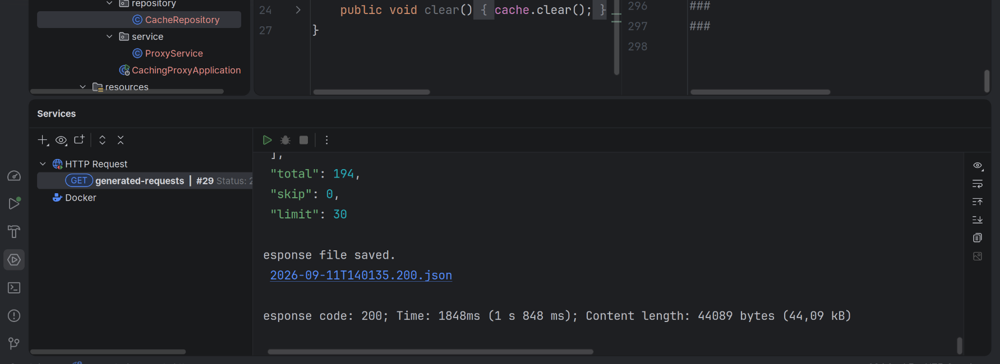
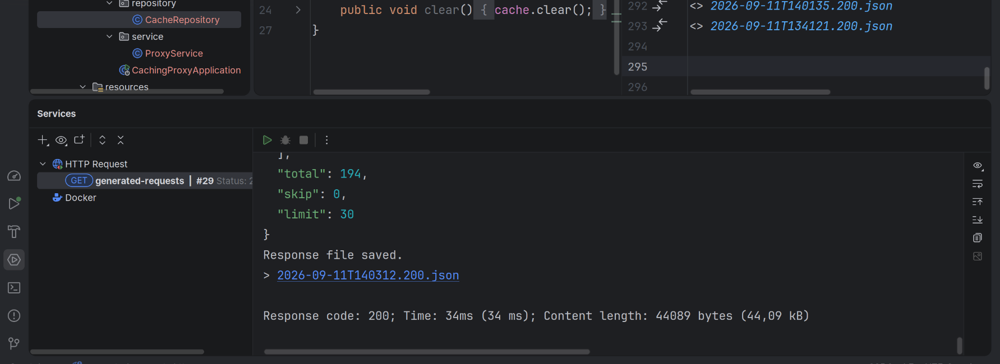
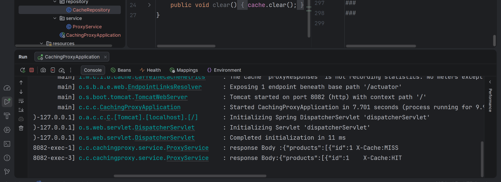
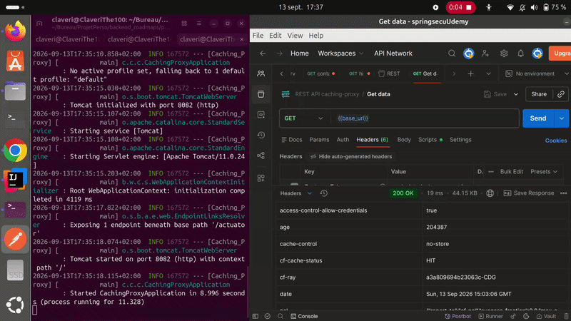

# Caching Proxy

> A caching proxy server built with Java 21 and Spring Boot.

This project is my implementation of the [Caching Server project on roadmap.sh](https://roadmap.sh/projects/caching-server). It forwards `GET` requests to an origin server, stores each response in an in-memory cache, and returns cached responses for repeated requests.

[Deutsche Version](README_DE.md)

## Current status

The proxy, its in-memory cache, the command-line arguments, and cache clearing are implemented.

Implemented:

- Forward `GET` requests to a configurable origin server.
- Cache responses by request path and query string in a thread-safe in-memory map.
- Preserve the origin response headers and body.
- Add `X-Cache: MISS` when the origin server was called and `X-Cache: HIT` when the response came from cache.
- Log each cache result (`X-Cache: HIT` or `X-Cache: MISS`).
- Accept `--port` and `--origin` command-line arguments.
- Clear the running server's cache with `--clear-cache`.
- Unit-test the cache-hit path.

Not implemented yet:

- Cache expiry/eviction. The cache currently remains populated until the application stops.
- Proxying HTTP methods other than `GET`.

## Prerequisites

- Java 21
- No separate Maven installation is needed: the Maven Wrapper is included.

## Run locally

The `caching-proxy` launcher builds the JAR automatically when it is not already present. The default configuration is:

```properties
server.port=8082
proxy.origin=https://dummyjson.com
```

Start it with the defaults:

```bash
./caching-proxy
```

Start the proxy on port `8082` and forward requests to DummyJSON:

```bash
./caching-proxy --port 8082 --origin https://dummyjson.com
```

Then make the same request twice:

```bash
curl -i http://localhost:8082/products
curl -i http://localhost:8082/products
```

The first response contains `X-Cache: MISS`; the second contains `X-Cache: HIT`.

## Clear the cache

Keep the proxy running, then use a second terminal to clear its in-memory cache. For a proxy running on port `3000`:

```bash
./caching-proxy --port 8082 --clear-cache
```

This sends `POST /internal/clear-cache` to the local proxy. The next matching `GET` request will be an `X-Cache: MISS`.

## How it works

1. The controller receives a `GET` request and keeps its path and optional query string.
2. The service looks up that value in `CacheRepository`.
3. On a miss, it calls `proxy.origin + path`, returns the origin response, and saves the body and headers in the cache.
4. On a hit, it returns the stored body and headers without calling the origin server.

## Demonstration

The first request goes to the origin server (about 1.8 s in this capture):



The repeated request is served much faster from cache (34 ms in this capture):



The application logs confirm the expected sequence: `X-Cache: MISS`, followed by `X-Cache: HIT`.

 

The video of demonstration of a request with my cachingProxy



## Tests

```bash
./mvnw test
```

## Next step

Add cache expiry/eviction and integration tests that verify a real miss followed by a hit and cache clearing.

## License

No license has been selected yet.
